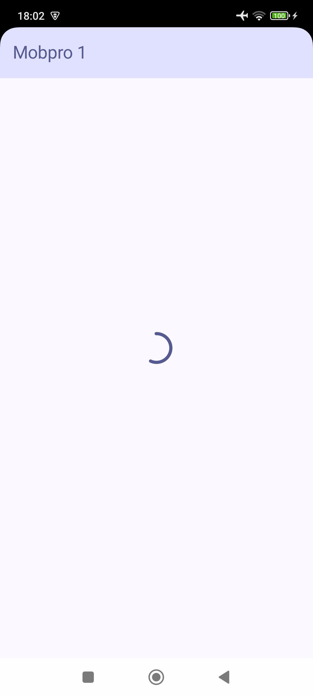
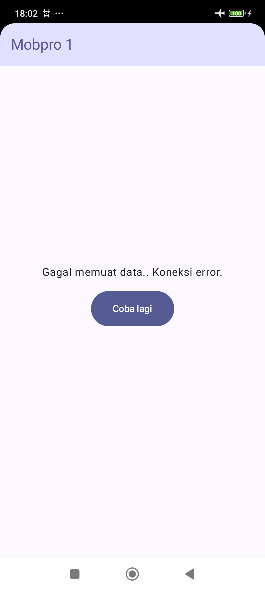

# Galeri Hewan

Aplikasi Android sederhana yang menampilkan gambar hewan dalam bentuk grid. Data berasal dari [REST API](https://gh.d3ifcool.org/).

| Tampilan Loading                                | Tampilan Utama                               | Tampilan Error                                |
|-------------------------------------------------|----------------------------------------------|-----------------------------------------------|
|  |  |  |

Di modul ini kita belajar:
- membuat indikator loading image
- menangani gambar gagal di-load
- membuat indikator loading JSON
- menangani JSON gagal di-load
- memigrasikan API static ke dynamic

Punya pertanyaan atau masukan? Silahkan disampaikan melalui issue repository.

## Lisensi

    Copyright (c) 2024-2025 Indra Azimi. All rights reserved.

    Dibuat untuk buku berjudul "Pemrograman Android Dasar".
    Dilarang melakukan penggandaan dan atau komersialisasi,
    sebagian atau seluruh bagian, baik cetak maupun elektronik
    terhadap project ini tanpa izin pemilik hak cipta.