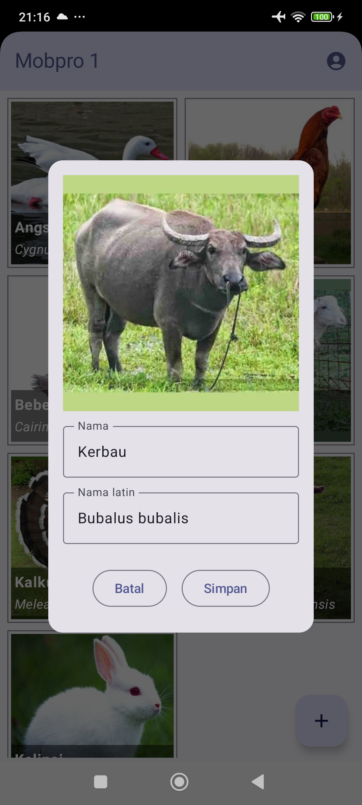

# Galeri Hewan

Aplikasi Android yang menampilkan gambar hewan dalam bentuk grid. Data berasal dari [REST API](https://gh.d3ifcool.org/). Pengguna bisa login menggunakan Google Sign-In dan menambahkan data hewan baru.

| Tampilan Utama                               | Form Tambah Data                               |
|----------------------------------------------|------------------------------------------------|
|  |  |

Di modul ini kita belajar:
- mengambil gambar dari kamera perangkat
- membuat dialog untuk form tambah data
- mengirim data teks dan image ke server
- menampilkan data sesuai yang login

Punya pertanyaan atau masukan? Silahkan disampaikan melalui issue repository.

## Lisensi

    Copyright (c) 2024-2025 Indra Azimi. All rights reserved.

    Dibuat untuk buku berjudul "Pemrograman Android Dasar".
    Dilarang melakukan penggandaan dan atau komersialisasi,
    sebagian atau seluruh bagian, baik cetak maupun elektronik
    terhadap project ini tanpa izin pemilik hak cipta.