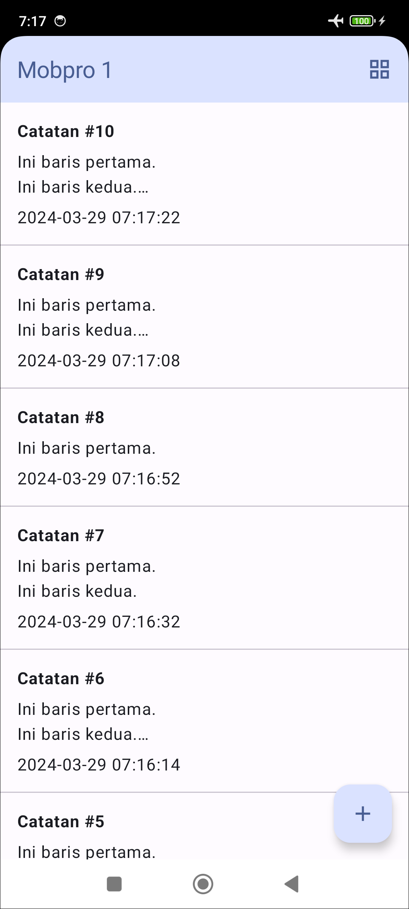
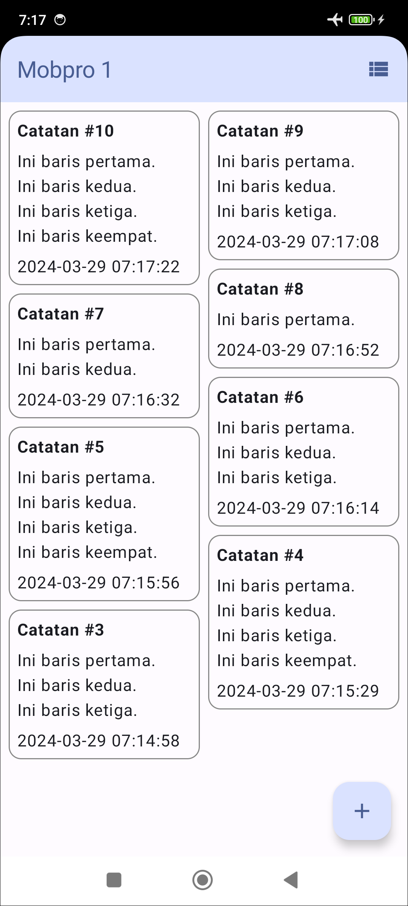
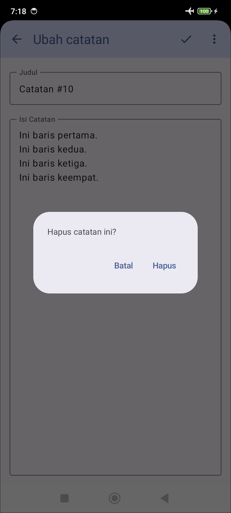

# Aplikasi Catatan

Aplikasi Android untuk membuat catatan sederhana. Di modul ini, kita membuat dialog konfirmasi hapus. Kita juga membuat tampilan grid, dan menyimpan mode tampilan mana yang dipilih oleh pengguna, apakah list atau grid.

| Tampilan Utama (list)                         | Tampilan Utama (grid)                         | Dialog Konfirmasi Hapus                        |
|-----------------------------------------------|-----------------------------------------------|------------------------------------------------|
|  |  |  |

Di modul ini kita belajar:
- membuat dialog sesuai kebutuhan
- membuat menu yang dinamis
- membuat tampilan staggered grid
- menyimpan data berupa key-value

Punya pertanyaan atau masukan? Silahkan disampaikan melalui issue repository.

## Lisensi

    Copyright (c) 2024-2025 Indra Azimi. All rights reserved.

    Dibuat untuk buku berjudul "Pemrograman Android Dasar".
    Dilarang melakukan penggandaan dan atau komersialisasi,
    sebagian atau seluruh bagian, baik cetak maupun elektronik
    terhadap project ini tanpa izin pemilik hak cipta.