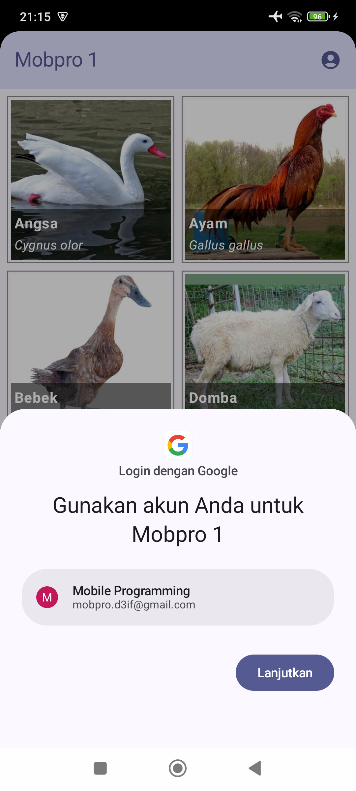
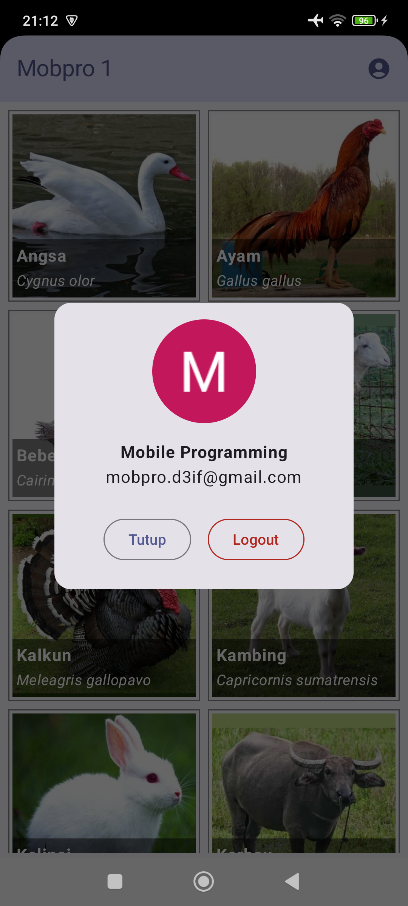

# Galeri Hewan

Aplikasi Android sederhana yang menampilkan gambar hewan dalam bentuk grid. Data berasal dari [REST API](https://gh.d3ifcool.org/). Pengguna bisa login menggunakan Google Sign-In.

| Tampilan Utama                               | Tampilan Login                                | Tampilan Profil                                |
|----------------------------------------------|-----------------------------------------------|------------------------------------------------|
|  |  |  |

Di modul ini kita belajar:
- membuat fitur login dengan Google
- menyimpan data akun pengguna
- membuat tampilan profil
- membuat fitur logout

Punya pertanyaan atau masukan? Silahkan disampaikan melalui issue repository.

## Lisensi

    Copyright (c) 2024-2025 Indra Azimi. All rights reserved.

    Dibuat untuk buku berjudul "Pemrograman Android Dasar".
    Dilarang melakukan penggandaan dan atau komersialisasi,
    sebagian atau seluruh bagian, baik cetak maupun elektronik
    terhadap project ini tanpa izin pemilik hak cipta.