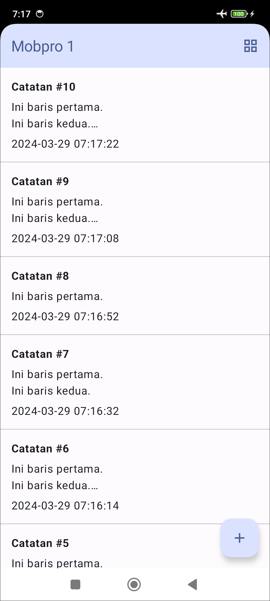
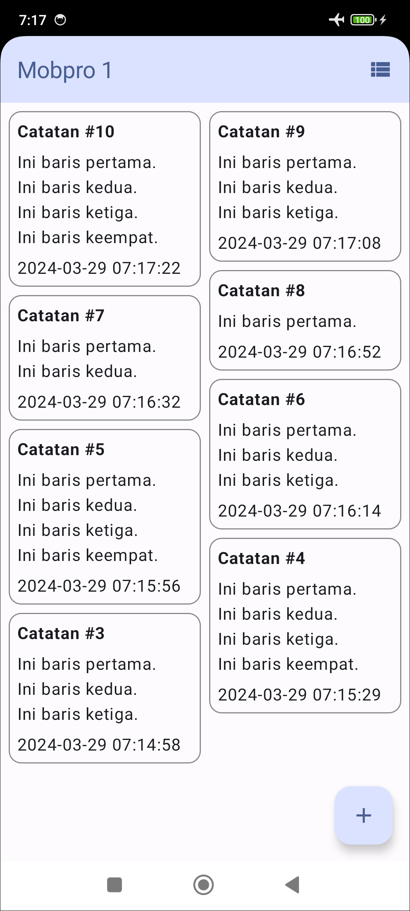
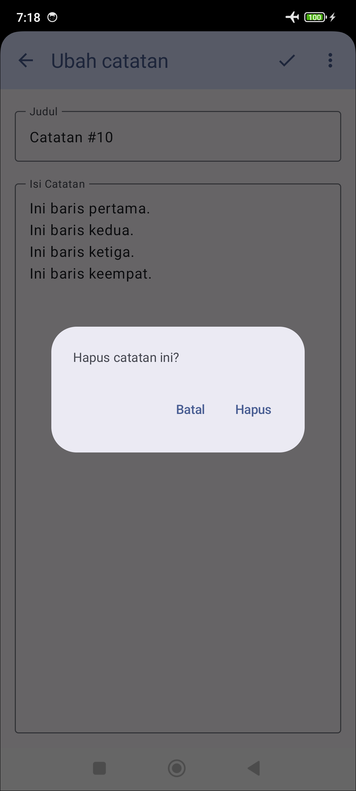

# Aplikasi Catatan

Aplikasi Android untuk membuat catatan sederhana. Di modul ini, kita membuat dialog konfirmasi hapus. Kita juga membuat tampilan mode grid, dan menyimpan mode tampilan mana yang dipilih oleh pengguna, apakah list atau grid.

| Tampilan Utama (list)                         | Tampilan Utama (grid)                         | Dialog Konfirmasi Hapus                        |
|-----------------------------------------------|-----------------------------------------------|------------------------------------------------|
|  |  |  |

Tutorial untuk mengerjakan aplikasi ini tersedia [di sini](https://drive.google.com/file/d/1GT3k241onfCw1wiE5SM3P51akgNWCIlA/view?usp=drive_link).

Punya pertanyaan atau masukan? Silahkan disampaikan melalui issue repository.

## Lisensi

    Copyright (c) 2021-2024 Indra Azimi. All rights reserved.

    Dibuat untuk kelas Pemrograman untuk Perangkat Bergerak 1.
    Dilarang melakukan penggandaan dan atau komersialisasi,
    sebagian atau seluruh bagian, baik cetak maupun elektronik
    terhadap project ini tanpa izin pemilik hak cipta.