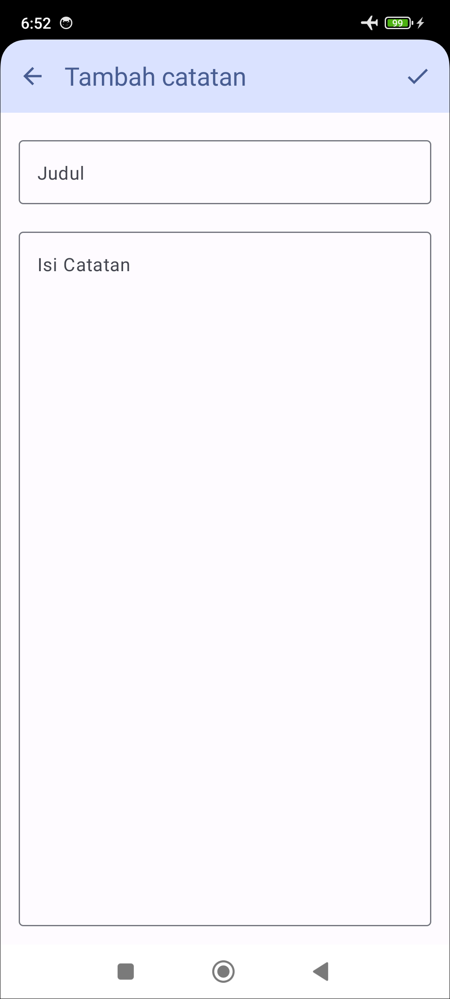
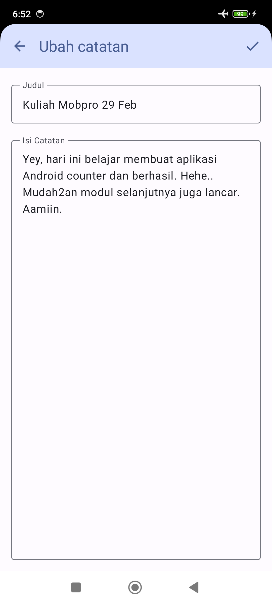

# Aplikasi Catatan

Aplikasi Android untuk membuat catatan sederhana. Di modul ini, kita membuat form tambah catatan dan form ubah catatan menggunakan navigasi yang membawa data.

| Tampilan Utama                               | Form Tambah Catatan                          | Form Ubah Catatan                            |
|----------------------------------------------|----------------------------------------------|----------------------------------------------|
|  |  |  |

Tutorial untuk mengerjakan aplikasi ini tersedia [di sini](https://drive.google.com/file/d/1Wj6KXvRHkFGvmu-VBCL1X8xUFf8jEcvw/view?usp=drive_link).

Punya pertanyaan atau masukan? Silahkan disampaikan melalui issue repository.

## Lisensi

    Copyright (c) 2021-2024 Indra Azimi. All rights reserved.

    Dibuat untuk kelas Pemrograman untuk Perangkat Bergerak 1.
    Dilarang melakukan penggandaan dan atau komersialisasi,
    sebagian atau seluruh bagian, baik cetak maupun elektronik
    terhadap project ini tanpa izin pemilik hak cipta.