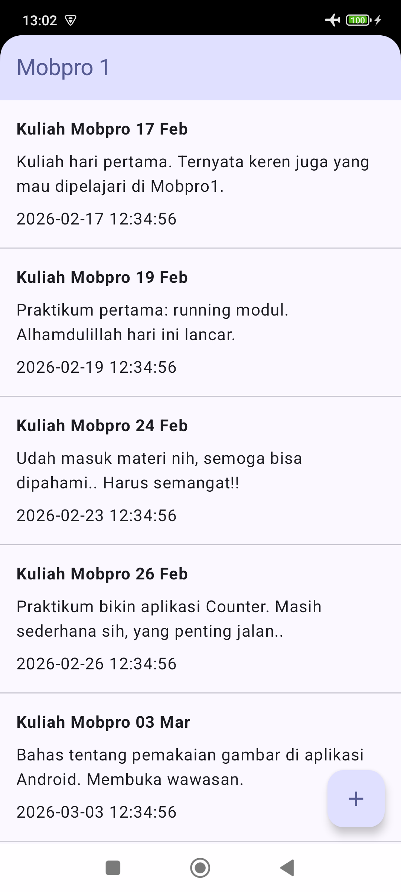

# Counter App

Aplikasi Android sederhana dengan satu `Text` dan satu `Button`. Berfungsi sebagai aplikasi counter yang mana ketika tombol ditekan, maka angka akan bertambah satu.

Tutorial untuk mengerjakan aplikasi ini tersedia [di sini](https://drive.google.com/file/d/1RFpCWokUNMXEjX-a221pUjwi92-v0heP/view?usp=drive_link).

Punya pertanyaan atau masukan? Silahkan disampaikan melalui issue repository.

## Lisensi

    Copyright (c) 2021-2024 Indra Azimi. All rights reserved.

    Dibuat untuk kelas Pemrograman untuk Perangkat Bergerak 1.
    Dilarang melakukan penggandaan dan atau komersialisasi,
    sebagian atau seluruh bagian, baik cetak maupun elektronik
    terhadap project ini tanpa izin pemilik hak cipta.