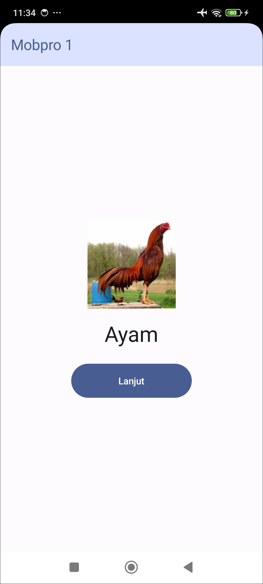

# Aplikasi Catatan

Aplikasi Android untuk membuat catatan sederhana. Di modul ini, kita menambahkan database, sehingga catatan pengguna bisa disimpan.

| Tampilan Utama                               | Form Tambah Catatan                          | Form Ubah Catatan                            |
|----------------------------------------------|----------------------------------------------|----------------------------------------------|
|  |  |  |

Di modul ini kita belajar:
- mengambil data dari database
- menyimpan data baru ke database
- meng-update data di database
- menghapus data dari database

Punya pertanyaan atau masukan? Silahkan disampaikan melalui issue repository.

## Lisensi

    Copyright (c) 2024-2025 Indra Azimi. All rights reserved.

    Dibuat untuk buku berjudul "Pemrograman Android Dasar".
    Dilarang melakukan penggandaan dan atau komersialisasi,
    sebagian atau seluruh bagian, baik cetak maupun elektronik
    terhadap project ini tanpa izin pemilik hak cipta.