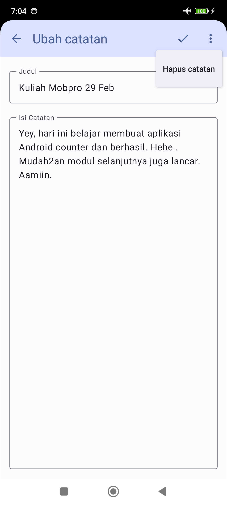

# Aplikasi Catatan

Aplikasi Android untuk membuat catatan sederhana. Di modul ini, kita membuat form tambah catatan dan form ubah catatan menggunakan navigasi yang membawa data.

| Tampilan Utama                               | Form Tambah Catatan                          | Form Ubah Catatan                            |
|----------------------------------------------|----------------------------------------------|----------------------------------------------|
|  |  |  |

Di modul ini kita belajar:
- menggunakan fitur cherry-pick dari Git
- menyelesaikan (resolve) Git conflict
- melakukan navigasi dengan data
- membuat form ubah data yang baik

Punya pertanyaan atau masukan? Silahkan disampaikan melalui issue repository.

## Lisensi

    Copyright (c) 2024-2025 Indra Azimi. All rights reserved.

    Dibuat untuk buku berjudul "Pemrograman Android Dasar".
    Dilarang melakukan penggandaan dan atau komersialisasi,
    sebagian atau seluruh bagian, baik cetak maupun elektronik
    terhadap project ini tanpa izin pemilik hak cipta.