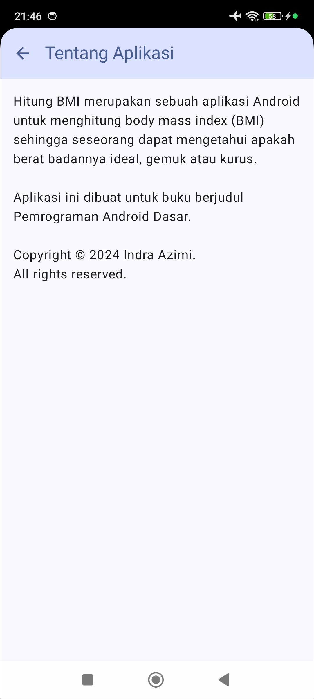

# Hitung BMI

Aplikasi Android untuk menghitung body mass index (BMI) sehingga pengguna dapat mengetahui apakah berat badannya ideal, gemuk atau kurus. Di sini kita menambahkan tampilan about sehingga pengguna dapat berpindah dari tampilan utama ke tampilan berikutnya menggunakan menu. Kita juga menambahkan tombol bagikan sehingga pengguna dapat berbagi data ke aplikasi lain.

| Tampilan Utama                               | Tampilan About                                |
|----------------------------------------------|-----------------------------------------------|
|  |  |

Di modul ini kita belajar:
- membuat aplikasi multi-screen
- membuat menu di TopAppBar
- membuat tombol Up di screen kedua
- bernavigasi ke aplikasi lain dengan Intent

Punya pertanyaan atau masukan? Silahkan disampaikan melalui issue repository.

## Lisensi

    Copyright (c) 2024-2025 Indra Azimi. All rights reserved.

    Dibuat untuk buku berjudul "Pemrograman Android Dasar".
    Dilarang melakukan penggandaan dan atau komersialisasi,
    sebagian atau seluruh bagian, baik cetak maupun elektronik
    terhadap project ini tanpa izin pemilik hak cipta.